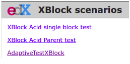
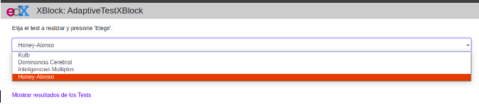
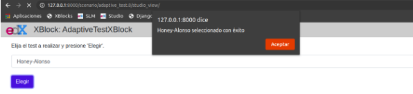
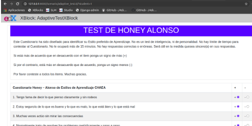
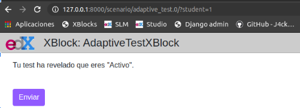
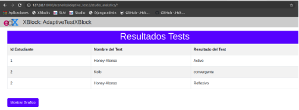
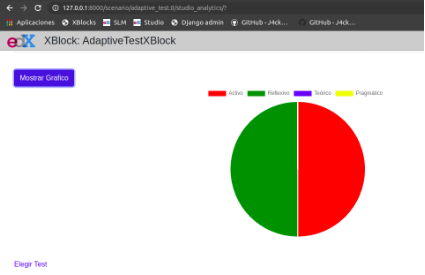

# :book: XBlock Estilos de Aprendizaje <!-- omit in toc -->

Este XBlock fue creado con el fin de obtener el estilo de aprendizaje de los estudiantes de un curso de OpenEDX, para que el profesor conozca a partir de cualquiera de los test disponibles que material del curso debe subir y se ajuste a cada estilo de aprendizaje de los estudiantes.

Para comprender el funcionamiento de este XBlock, es necesario haber visto la guía de [MyXBlock](https://github.com/J4ckDev/MyXblock) y [XBlockPrueba](https://github.com/J4ckDev/XBlockPrueba).

## :clipboard: Contenido <!-- omit in toc -->

- [1. Características](#1-características)
  - [1.1. Test disponibles](#11-test-disponibles)
  - [1.2. Gestión de la información](#12-gestión-de-la-información)
    - [1.2.1. Campos o fields](#121-campos-o-fields)
    - [1.2.2. Función para cargar un test](#122-función-para-cargar-un-test)
    - [1.2.3. Función para subir los resultados](#123-función-para-subir-los-resultados)
    - [1.2.4. Función para mostrar los resultados](#124-función-para-mostrar-los-resultados)
- [2. Instalación](#2-instalación)
- [3. Modo de Uso](#3-modo-de-uso)

## 1. Características

En esta sección se especifican las características más relevantes del XBlock.

### 1.1. Test disponibles

Los test actualmente implementados están basados en los siguientes modelos:

1. **Modelo de Kolb:** Se distinguen 4 posibles estilos de aprendizaje según la forma en la que las personas prefieren tratar con la información de su entorno. Los estilos de aprendizaje posibles son: 
   
   - *Activo o divergente:* Se caracterizan por que aprenden mejor cuando las actividades supongan un desafío, sean cortas, sean concisas y se sientan emocionados a desarrollarlas. 
   - *Reflexivo o asimilador:* Son estudiantes que observan y analizan la información desde muchos puntos de vista, antes de sacar una conclusión; por esa razón son estudiantes que aprenden mejor en los casos donde pueden observar las cosas detenidamente, analizarlas y reflexionar antes de actuar.
   - *Teórico o convergente:* Es el estudiante que acomoda e integra la información de forma lógica y secuencial para generar una teoría sobre lo que está aprendiendo, de esta manera lo convierte una persona investigativa para estar seguro de que todo lo aprendido es demostrable. 
   - *Pragmático o acomodador:* Este último estilo representa a los estudiantes que se sienten cómodos colocando en práctica los nuevos conocimientos, teorías y técnicas; por ende son muy realistas, prácticos, tienen gran capacidad en resolver problemas y siempre buscan la manera más fácil de hacer las cosas.

    Sí desea más información sobre el modelo de Kolb, puede leer [aquí](https://psicologiaymente.com/desarrollo/modelo-de-kolb-estilos-aprendizaje).

2. **Modelo de Inteligencias Múltiples:** Este modelo define la inteligencia como el conjunto de capacidades que nos permite resolver problemas o fabricar productos valiosos en nuestra cultura; además, según la capacidad que más desarrolle un individuo puede variar de una inteligencia a otra. A continuación se hizo una tabla con los tipos de inteligencia posibles y como aprende mejor el estudiante:
   
    |Inteligencia|Aprende mejor|
    |------------|-------------|
    |Verbal o lingüística|Usando el lenguaje de forma oral o escrita.|
    |Lógico-matemática|Haciendo uso de la lógica y razomnamiento que encuentran en los números.|
    |Visual-Espacial|Relacionando el color, la línea, la forma y el espacio para construir o dibujar los objetos que visualiza en su mente.|
    |Kinestésica-corporal|Tocando, moviendo y procesando la información a través de sensaciones corporales.|
    |Musical|Escuchando y creando música o melodías.|
    |Interpersonal|Compartiendo, entrevistando y cooperando con otros.|
    |Intrapersonal|Trabajando solo, haciendo proyectos a su propio ritmo y teniendo sus espacios para reflexionar.|

    Sí desea más información sobre este modelo, puede leer [aquí](https://fun4us.org/2016/03/14/estilos-de-aprendizaje-y-las-inteligencias-multiples/).

3. **Modelo de Honey Alonso:** Parte de la teoría y los cuestionarios del modelo de Kolb; sin embargo, este modelo define una descripción más detallada para cada uno de los estilos de aprendizaje. Los estilos de aprendizaje propuestos son:
   
    - *Activo:*  Son personas abiertas que se implican plenamente en las nuevas experiencias para aprender cosas nuevas. 
    - *Reflexivo:* Estas personas aprenden observando y analizando las experiencias desde diferentes puntos de vista, por lo que se toman el tiempo necesario para llegar a conclusiones apropiadas.
    - *Teórico:* Les gusta entender la teoría detrás de las acciones, por lo que necesitan modelos, conceptos y hechos para analizarlos y sintetizarlos en una teoría lógica y sistemática. 
    - *Pragmático:* Las personas de este estilo de aprendizaje se caracterizan por el deseo de saber como poner en práctica todo lo aprendido.
 
    Sí desea más información sobre el modelo propuesto por Honey y Mumford, puede leer [aquí](http://www.comapp-online.de/materials/es/Handout_14_LearningStyles_EN.pdf).

4. **Modelo de Dominancia Cerebral:** Es un modelo que se basa en los cuadrantes cerebrales para representar las formas diferentes de pensar, operar, crear, aprender actuar y convivir con el mundo. Los estilos de aprendizaje pueden ser:
   
   - *Lógico:* Son las personas que basan su aprendizaje en el razonamiento y los hechos para apoyarse en sus decisiones.
   - *Organizado:* Tienen un pensamiento estructurado y secuencial para planificar hasta los mínimos detalles, esto los hace personas que encanta conocer el funcionamiento de las cosas y les permite aprender con la práctica. 
   - *Interpersonal:* Suelen ser las personas más idealistas y dispersas de los 4 tipos, esto las hace personas que aprenden con el autodescubrimiento, la construcción de conceptos y la búsqueda de posibilidades ocultas o no evidentes. 
   - *Holístico:* Aprende compartiendo y escuchando ideas, esto los hace buenos en el trabajo en equipo.
    
    Sí desea conocer más sobre este modelo, puede leer [aquí](https://mattec.matedu.cinvestav.mx/el_calculo/data/docs/P9.bbf0a982b7788f.pdf).

### 1.2. Gestión de la información

El XBlock permite guardar la información para cada uno de los test disponibles y dependiendo si es un profesor o un estudiante, se le muestra la información.

#### 1.2.1. Campos o fields
Los campos o fields definidos para almacenar los datos son los siguientes:

|Campo o Field|Tipo|Alcance|Descripción|
|-------------|----|-------|-----------|
|testNumber|Integer|`user_state_summary`|Guarda el test elegido por el profesor y que se mostrará a los estudiantes para obtener su estilo de aprendizaje.|
|testResult|`JSON`|`user_state`|Almacena el resultado del estilo de aprendizaje obtenido por un estudiante.|
|testResults|`JSON`|`user_state_summary`|Guarda los resultados de todos los estudiantes y el estilo de aprendizaje correspondiente a cada uno de los test.|
|testSolved|`Boolean`|`user_state`|Es una bandera que sirve para controlar cuando el estudiante ha respondido o no el test, si lo ha respondido tendrá un valor `True` en caso contrario `False`.|

#### 1.2.2. Función para cargar un test
En el archivo [`student_adaptive_test.js`](https://github.com/J4ckDev/XBlock-Estilos-de-Aprendizaje/blob/main/adaptive_test/adaptive_test/static/js/src/student_adaptive_test.js#L10) se definió una función que se ejecutará al finalizar la carga de la vista `student_adaptive_test.html`, para solicitar a la función [`load_test`](https://github.com/J4ckDev/XBlock-Estilos-de-Aprendizaje/blob/main/adaptive_test/adaptive_test/adaptive_test.py#L99) en el archivo `adaptive_test.py`, si se debe cargar o no un test al estudiante.

#### 1.2.3. Función para subir los resultados
Cuando el estudiante responde un test, una función en el archivo [`student_adaptive_test.js`](https://github.com/J4ckDev/XBlock-Estilos-de-Aprendizaje/blob/main/adaptive_test/adaptive_test/static/js/src/student_adaptive_test.js#L44) captura las respuestas, obtiene el estilo de aprendizaje del estudiante y envía el resultado a la función [`submit_test`](https://github.com/J4ckDev/XBlock-Estilos-de-Aprendizaje/blob/main/adaptive_test/adaptive_test/adaptive_test.py#L143) del archivo `adaptive_test.py`. Luego al estudiante se le muestra que estilo de aprendizaje tiene.

#### 1.2.4. Función para mostrar los resultados
Por último, cuando un profesor desea ver los resultados de todos los estudiantes, la función [`load_analytics`](https://github.com/J4ckDev/XBlock-Estilos-de-Aprendizaje/blob/main/adaptive_test/adaptive_test/adaptive_test.py#L173) es la encargada de retornar todos los valores del campo `testResults` que son procesados por [`studio_analytics.js`](https://github.com/J4ckDev/XBlock-Estilos-de-Aprendizaje/blob/main/adaptive_test/adaptive_test/static/js/src/studio_analytics.js#L8) y mostrados en `studio_analytics.html`.

## 2. Instalación

Para instalar este XBlock es necesario realizar los siguientes pasos:

1. Descargue este XBlock desde el *Release* o realice un `git clone` al repositorio.
2. Si descargó desde el *Release* descomprima el archivo y cópielo a la carpeta donde tiene el entorno virtual. Sí solo realizó el `git clone`, copie la carpeta donde tiene el entorno virtual.
3. Asegurese de inicializar el entorno virtual y ejecute el comando `pip install -e adaptive_test` para instalar el Xblock en el SDK.
4. Inicie el servidor del XBlock SDK y abra la dirección `http://127.0.0.1:8000/`, si aparece el XBlock fue instalado correctamente.

    

    

    

## 3. Modo de Uso

Asegurese de tener el entorno virtual activo y el servidor del SDK ejecutándose, luego ya puede realizar los siguientes pasos:

1. Para seleccionar el test con el cuál va a obtener los estilos de aprendizaje de los estudiantes, abra el navegador y dirijase a la vista de Studio siguiendo el enlace `http://127.0.0.1:8000/scenario/adaptive_test.0/studio_view/` y debe aparecer una ventana como la siguiente:

    

    

    

    Cuando elija uno de los test y de click en el botón *Elegir* le aparecerá el sisguiente mensaje de confirmación:

    

    

    

    >**Nota:** Si el profesor más adelante desea seleccionar otro test, lo puede hacer aunque los estudiantes ya hayan respondido el test anteriormente seleccionado.

2. Regrese a la vista de estudiante quitando abriendo el enlace `http://127.0.0.1:8000/scenario/adaptive_test.0/` y responda el test. Sí desea simular otros estudiantes agregue al final del enlace `?student=valor`, donde `valor` es el ID que le va a asignar al estudiante simulado.

    

    

    

    Al finalizar y enviar el cuestionario respondido, el estudiante obtendrá el estilo de aprendizaje que más lo representa.

    

    

    

3. Cuando el docente desee ver los resultados debe abrir la vista de Studio y dar click en el enlace *Mostrar resultados de los test* o puede abrir el enlace directo `http://127.0.0.1:8000/scenario/adaptive_test.0/studio_analytics/`, luego podrá observar una tabla similar a la siguiente:

    

    

    

4. Para el test de Honey Alonso existe la posibilidad de ver un gráfico de pastel para observar los resultados, solo debe dar click en el botón *Mostrar Gráfico* y podrá mirar lo siguiente:

    

    

    

Es importante mencionar que este XBlock solo funciona en el XBlock SDK porque al instalalarlo en OpenEDX se obtuvieron errores de visualización que no permitieron que funcionara correctamente.